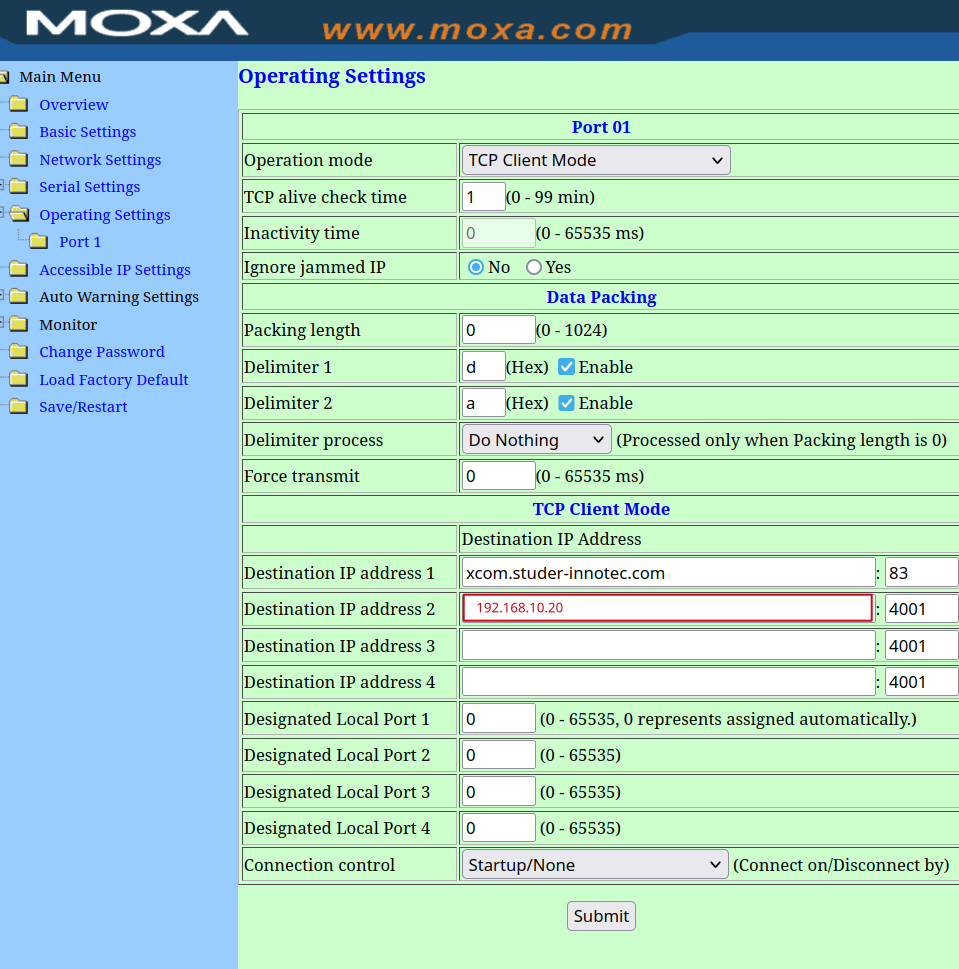

# Grafana for studer

This docker-compose suite is used to collect data from Studer into Influx/Grafana.

## How to setup

- install docker and docker-compose on a linux computer (rpi, virtual, ...) where you want to run this instance
- clone/[download](https://github.com/dusanmsk/studer/archive/refs/heads/main.zip) this repo there
- edit .env file and modify DATADIR, STUDER2INFLUX_PERIODIC_FREQUENCY_SEC etc
- run ./rebuild.sh

### Setup with XCOM-LAN

Open MOXA in web browser (default password should be 'xcomlan'), go to "Operating settings", "Port 1" and set "Destination IP address 2" to computer where docker-compose will run.

### Setup with XCOM-RS232
TBD, not implemented yet
Connect computer serial port with xcom-rs232, then "TODO binding serial port to container etc ..."

### Run docker-compose, then setup grafana

Enable debugging for a while (edit .env then set DEBUG=1). Now run docker in foreground `./run.sh` and watch for logs. You should see something like:

`DEBUG:Studer2Influx:Written {'PV_POWER': 0.0, 'PV_VOLTAGE': 5.53515625, 'PV_ENERGY_CURR_DAY': 11.078125, 'PV_ENERGY_TOTAL': 0.011077880859375,`

That means that data are successfully written into influx. Stop (CTRL+C) then disable debug and run again in background `./run.sh -d`

Now configure grafana. Go to http://YOUR_PC:3000, login as admin:admin, configure new password. Configure new influx datasource (masked password is 'grafana'):

Then create dashboard etc... Example query should be configured like this:

# Done
    