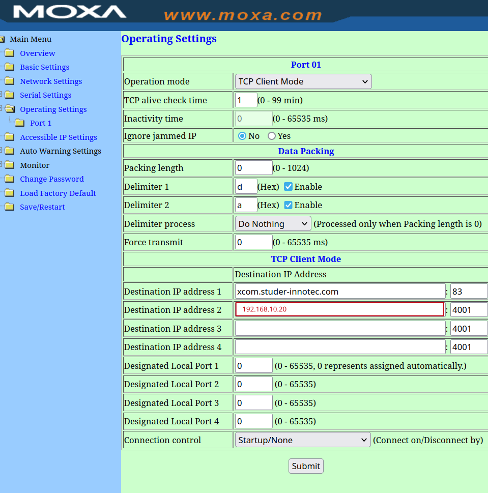
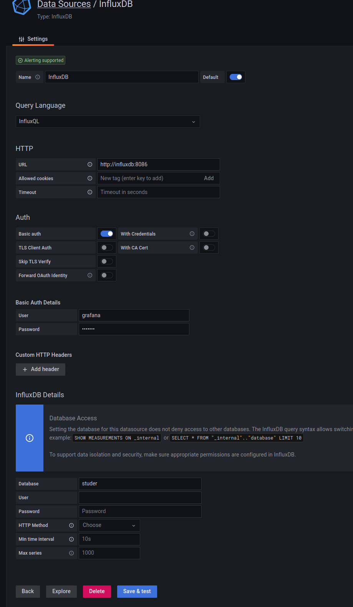

# Logger for studer

This docker-compose suite is used to collect data from Studer. Destinations where data are written are:
- InfluxDB
- MQTT broker
- UDP listener packets (for example Loxone miniserver)

Logger is bundled with influxdb/grafana and pre-configured to run without any additional setup when no other transports are required.

## How to setup

### Prerequisites

- install docker and docker-compose on a linux computer (rpi (see notes for rpi), virtual, ...) where you want to run this instance
- clone/[download](https://github.com/dusanmsk/studer/archive/refs/heads/main.zip) this repo there
- copy 'example.env' file as '.env' and edit what is necessary
- run ./bin/rebuild.sh
- 
##### Setup with XCOM-LAN

Open MOXA in web browser (default password should be 'xcomlan'), go to "Operating settings", "Port 1" and set "Destination IP address 2" to computer where this docker-compose suite will run.


##### Setup with XCOM-RS232
**TBD, not implemented yet**
Connect computer serial port with xcom-rs232, then "TODO binding serial port to container etc ..."


### A. Run everything bundled in

#### Run docker-compose

Enable debugging for a while (edit .env then set DEBUG=1). Now run docker in foreground `./bin/run_all.sh` and watch for logs. You should see something like:

`Written to influx: [{'measurement': 'solar_data', 'tags': {'deviceName': 'battery-0'}, 'fields': {'BATT_SOC': 99.0, 'BATT_TEMP': 26.296875,...`

That means that data are successfully written into influx. Stop (CTRL+C) then disable debug and run again in background `./bin/run_all.sh -d`

#### Setup grafana

Go to http://YOUR_PC:3000, login as admin:admin, configure new password. Configure new influx datasource (masked password on screenshot is 'grafana'):


Go to Dashboards, click on arrow on "New", select import, then upload json file from this repo (sample_dashboard.json) and choose right datasource.
Example dashboard is prepared for setup with 2 XTM and 2 VT devices. You should edit/modify/clone/duplicate queries to fit your needs.

#### You are done

### B. Run only studer logger (you have your own influx/mqtt/...)

Edit .env and setup influx/mqtt/udp transports. Run `./bin/run_bridge.sh` and watch for logs. If everything seems to be ok, stop (CTRL+C) and run again on background `./bin/run_bridge.sh -d`


# Notes

### Data formats

#### Influxdb

All measurements written into influxdb has the following format:

```
{
    "measurement": "solar_data",
    "tags": {
        "deviceName": "battery-0"
    },
    "fields": {
        "BATT_SOC": 99.0,
        "BATT_TEMP": 26.296875,
        "BATT_VOLT": 54.0,
        ...
```

Device names are: battery-N, XT-N, VT-N, VS-N. Script autodetects connected devices.

#### MQTT

All measurements written into mqtt has the following format:

- Topic name: studer/device_name/param_name
- Value: value                                

Topic name is always in lowercase.

##### Example

```
studer/vt_1/pv_voltage 100.75
studer/battery_0/batt_voltage 49.5625
studer/xt_1/ac_freq_in 49.984375
```

Note that 'studer' is default topic name, see 'MQTT_TOPIC' in .env file

#### UDP

All measurements written into udp has the following format:

- deviceName_paramName=value

Everything is lowercase.

##### Example

```
battery-0_batt_voltage=50.9375
xt-1_ac_freq_in=50.015625
xt-1_batt_cycle_phase_xt=4
```

### RPi

It is strongly recommended when running this on RPi or similar device to use USB3 ssd disk. SD card will be quickly destroyed by influxdb writes.